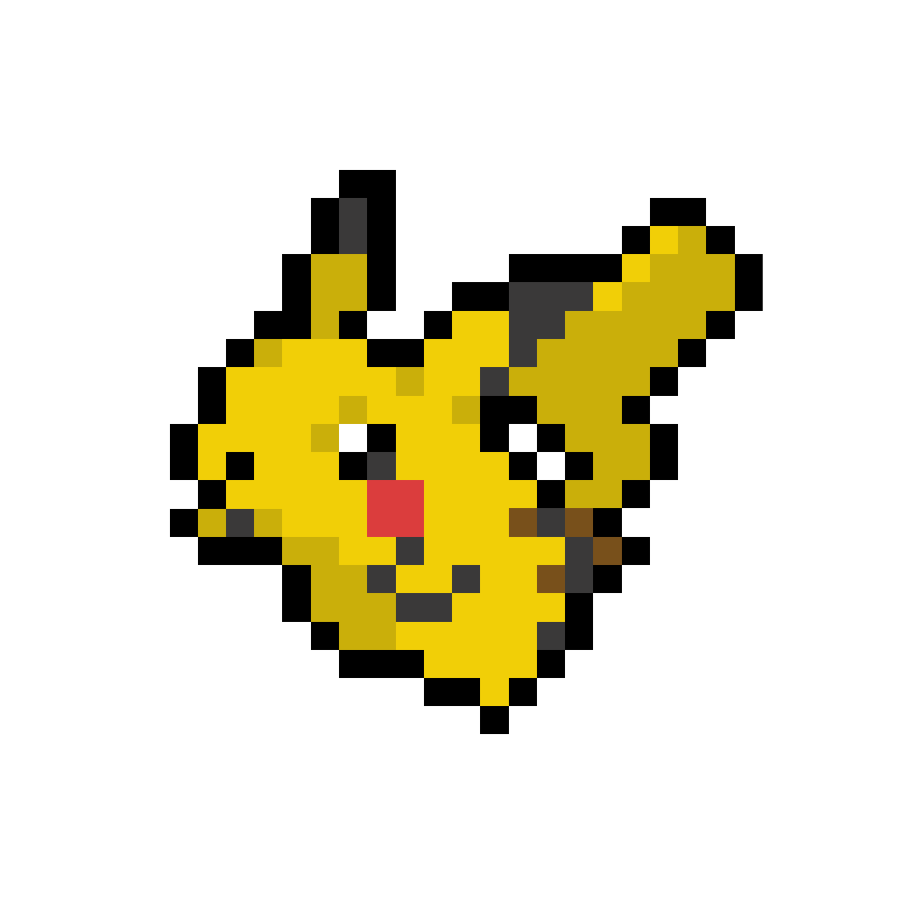

# ポケモン151図鑑

自作のドット絵アニメーションと外部API（PokeAPI）を組み合わせた、オリジナルのポケモン図鑑アプリケーションです。

**HAL EVENT WEEK 2025 受賞作品**

## 受賞・展示実績
- **最多得票賞受賞**（HAL EVENT WEEK 2025）
- **意欲賞受賞**（HAL EVENT WEEK 2025）

> **受賞のポイント**
> 全151種類のドット絵を自作した圧倒的な作業量や自身の集客力を評価していただきました。

## デモ
> [!NOTE]
> 録画環境の影響により、以下の動画ではポケモンのアニメーションがカクついて見える場合がありますが、実機では滑らかに動作します。

https://github.com/user-attachments/assets/3b13e7e1-33ce-44a8-84c8-7f8e15393c43
> 一覧画面の映像です

 

https://github.com/user-attachments/assets/5e182657-f0b6-4db5-b53d-58e1dddad46d
> タイプごとに絞り込んで表示している映像です（絞り込まれている様子が分かりやすいようにズームを80%にして表示しています）

 

https://github.com/user-attachments/assets/780d8f69-791e-4f09-a48f-a2380bb7bb5a
> 名前で検索している映像です

 

https://github.com/user-attachments/assets/afbb3d75-8d59-4839-b064-11be50d52ed5
> トップ画面から検索している映像です  
> **こだわり**：画面遷移時にオリジナルのローディングを実装しました

 

https://github.com/user-attachments/assets/f74bdb29-cea2-438d-9ce3-7b6d8d33e0cb
> ハンバーガーメニューです  
> **こだわり**：メニュー選択時に黒い三角が表示するように実装しました。ゲーム画面を彷彿とさせるデザインにすることによって、ユーザーがポケモン図鑑を使っているという没入感を高めています。

 

https://github.com/user-attachments/assets/64ba5559-3464-457a-9b67-da5826d85d88
> 図鑑の詳細を開いている映像です  
> **こだわり**：一覧画面でのホバー時や詳細画面において、静止画ではなくアニメーションを採用することで、ポケモンたちがいきいきとしている感じを視覚的に表現することで図鑑を開くたびにわくわくするような体験を重視しました。

### 実際のアニメーション
<table>
  <tr>
    <th width="50%">静止画（通常時）</th>
    <th width="50%">アニメーション（ホバー・詳細）</th>
  </tr>
  <tr>
    <td align="center">
      
    </td>
    <td align="center">
      
    </td>
  </tr>
</table>

## プロジェクト概要
本プロジェクトは、フロントエンドの基礎（HTML/CSS/JavaScript）の習得と、外部APIとの非同期通信の実装を目的として制作しました。

## デザインのこだわりと著作権について
本アプリでは、既存の画像データを直接流用せず、以下の通り独自の資産を使用しています。

- **グラフィックの再構築**: 既存のデザインを参照して、一から自身でドット打ちをして再現しました。
- **独自のアニメーション**: 静止画のデザインをベースに、**独自にGIFアニメーションのコマ割りを作成**し、図鑑として動的な演出を加えました。
- **権利帰属**: 著作権は、株式会社ポケモン及びその関連会社、任天堂株式会社、株式会社クリーチャーズ、株式会社ゲームフリーク並びにポケモングループの指定する第三者に帰属します。本アプリは個人学習を目的とした非営利作品であり、権利侵害を意図するものではありません。

## 使用技術
- **言語**: HTML5, CSS3, JavaScript (Vanilla JS)
- **API**: [PokeAPI](https://pokeapi.co/)
- **制作ツール**: [procreate](https://procreate.com/jp)

## 課題と現在の状況
現在、以下のパフォーマンス上の課題を認識しており、改善に向けた学習を進めています。

- **読み込み速度の低下**: データ量および自作GIFの読み込み負荷により、表示完了まで時間がかかる場合があります。
- **動作の安定性**: 大量の非同期通信が発生するため、通信状況により挙動が不安定になることがあります。

### 原因分析と今後の改善計画
- **原因**: ページネーション未実装によるデータの一括取得、および画像ファイルの最適化不足。
- **改善案**: 
  - 20件ずつ取得する「ページネーション」または「無限スクロール」の実装。
  - WebP形式への変換による画像軽量化。
